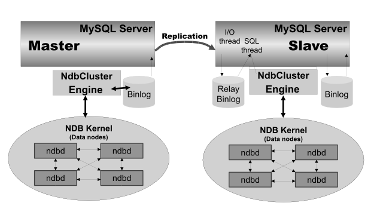

# High Availablity

## MHA (Master High Availability Manager and tools)

> 1. A primary objective of MHA is automating master failover and slave promotion within short (usually 10-30 seconds) downtime, without suffering from replication consistency problems...

> 2. MHA also provides a way for scheduled online master switch: changing currently running master to a new master safely, within a few seconds (0.5-2 seconds) of downtime (blocking writes only).

* [MHA 部署实践](http://www.cnblogs.com/gomysql/p/3675429.html)

## [MySQL NDB Cluster](https://dev.mysql.com/doc/refman/5.7/en/mysql-cluster.html)

> MySQL NDB Cluster is a high-availability, high-redundancy version of MySQL adapted for the distributed computing environment.

NDB 是一个存储引擎，在整个MySQL架构体系中和InnoDB的位置一样。

### NDB Cluster 分为3种节点

* Management node (mgmd)
* SQL node (mysqld)
* Data node (ndbd)

NDB 是实现分布式存储，每个Data node存储一部分fragment数据（也可以配置成全部冗余），实现mysqld冗余的一种部署方案如下

## [MariaDB Galera Cluster](https://mariadb.com/kb/en/library/galera-cluster/)

> MariaDB Galera Cluster is a synchronous multi-master cluster for MariaDB. 

> Galera replication happens at transaction commit time by broadcasting the transaction write set to the cluster for applying.

> wsrep API (write set replication API)

### Features

* Synchronous replication
* Active-active multi-master topology
* Read and write to any cluster node
* Automatic membership control, failed nodes drop from the cluster
* Automatic node joining
* True parallel replication, on row level
* Direct client connections, native MariaDB look & feel

VIP 节点做一次负载均衡，为防止VIP单点故障，再利用Keepalived做冗余
